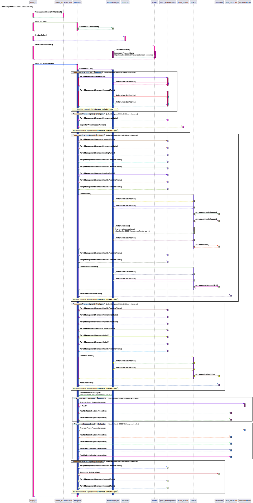
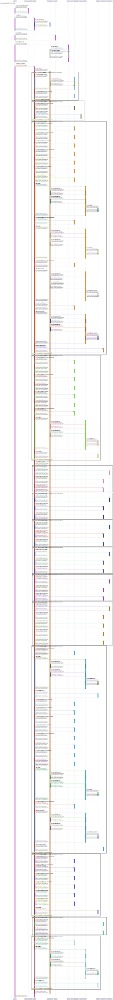

prospan
=====

An escript for extracting span information from services log events from woody

Build
-----

    $ make

Run
---

    $ _build/default/bin/prospan

Draw a sequence diagram from aggregated log messages collection queried from elasticsearch:

    $ cat /path/to/elastic/response.json | _build/default/bin/prospan -p | java -jar bin/plantuml.jar -p -svg > output.svg

Output examples:




(with timestamps and metadata)


Zipkin
------

Translate and upload to running zipkin instance via [API V2](https://zipkin.io/zipkin-api/#/default/post_spans)

```erlang
{ok, RawData} = file:read_file("/path/to/elastic/response.json"),
Data = jsone:decode(RawData, [{object_format, map}]),
Events = prospan_utils:unwrap_messages(Data),
Spans = prospan_zipkin:collect_spans(Events, []),
JsonOptsPretty = [native_utf8, native_forward_slash, {space, 1}, {indent, 2}]
Body = jsone:encode(Spans, [skip_undefined | JsonOptsPretty]),
ok = prospan_uploader:upload(Body, #{base_uri => "http://127.0.0.1:9411"}).
```